# Azure Sentinel (SIEM) Honeypot Lab

## 📖 Table of Contents
* [Goal](#goal)
* [Project Motivation](#project-motivation)
* [System Architecture](#system-architecture)
* [Phase 1: Setting the Bait (VM Setup)](#phase-1-setting-the-bait-vm-setup)
* [Phase 2: Adding Context (Log Enrichment)](#phase-2-adding-context-log-enrichment)
* [Phase 3: Connecting the SIEM (Data Ingestion)](#phase-3-connecting-the-siem-data-ingestion)
* [Phase 4: Detecting the Threat (Analytics)](#phase-4-detecting-the-threat-analytics)
* [Phase 5: Automated Response (SOAR)](#phase-5-automated-response-soar)
* [Challenges & Lessons Learned](#challenges--lessons-learned)

---

### Goal
The objective of this project was to build a live "Honeypot" environment to observe real-world cyber attacks in real-time. By exposing a vulnerable server to the internet, I was able to capture attack data, enrich it with geographic information, and use **Microsoft Sentinel** to detect patterns and automate security responses.

### Project Motivation
I initiated this lab to gain deep, hands-on exposure to **Detection Engineering and SIEM management**. My goal was to move beyond theoretical security and architect a functional, end-to-end security pipeline that could ingest, enrich, and respond to real-world threats in a live cloud environment.

---

## 🏗️ System Architecture

The project follows a logical flow of data from the initial point of attack to the final automated response:

1.  **Traffic Entry:** Attackers target the Windows VM via an exposed RDP Port (3389).
2.  **Log Capture:** A PowerShell script monitors failed login attempts (Event ID 4625).
3.  **Data Enrichment:** The script queries the IPGeolocation.io API to add geographical context.
4.  **Data Ingestion:** The Azure Monitor Agent (AMA) sends the enriched logs to the Log Analytics Workspace.
5.  **Detection & Response:** Microsoft Sentinel identifies brute-force patterns and triggers a Logic App for automated email alerts.

---

## Phase 1: Setting the Bait (VM Setup)
**Objective:** To establish a controlled, isolated environment that mimics a vulnerable enterprise asset.

**What I did:**
I provisioned a Windows Virtual Machine in Azure and intentionally "opened" the security settings. Specifically, I configured the **Network Security Group (NSG)** to allow anyone on the internet to attempt a Remote Desktop (RDP) connection. 

* **The Result:** Within minutes of going live, the VM began receiving connection attempts from various automated scanners across the internet.

**Evidence:**
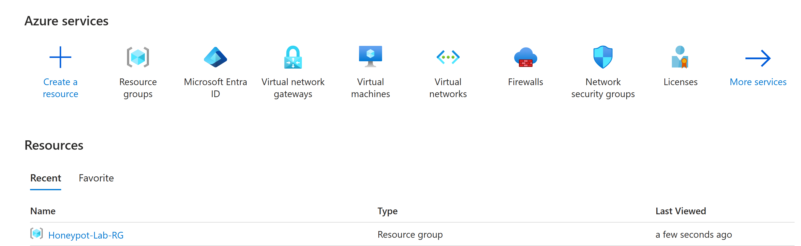
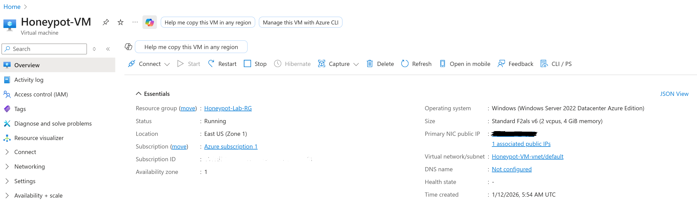
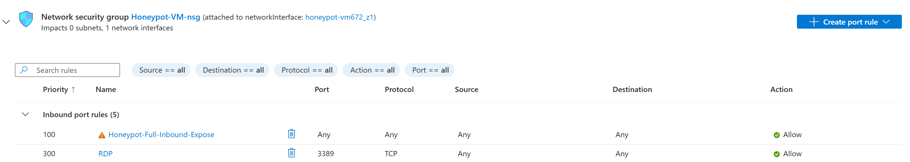

---

## Phase 2: Adding Context (Log Enrichment)
**Objective:** To transform anonymous IP addresses into actionable geographic threat intelligence.

**What I did:**
Standard logs only show an IP address. I used a **PowerShell script** that monitors for failed login attempts (Event ID 4625). The script extracts the source IP and queries the **ipgeolocation.io API** to retrieve the attacker's Country, City, and Coordinates.

* **The Result:** I successfully generated an enriched log file (`failed_rdp_geo.log`) that revealed attacks originating from countries such as **Peru, Chile, and France**.

**Evidence:**
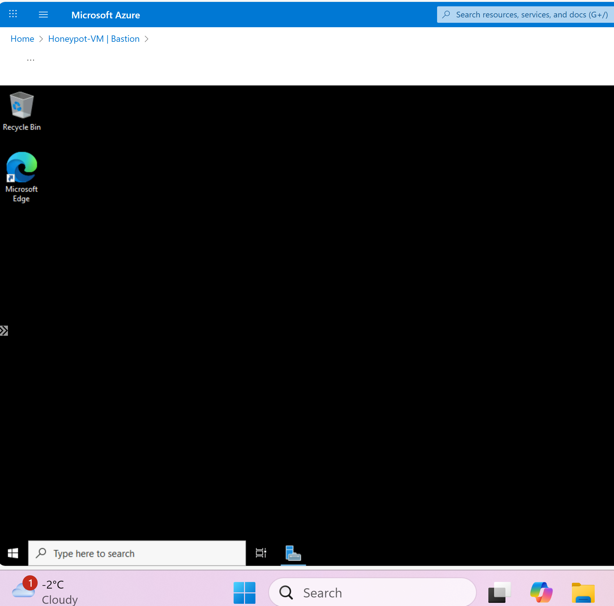
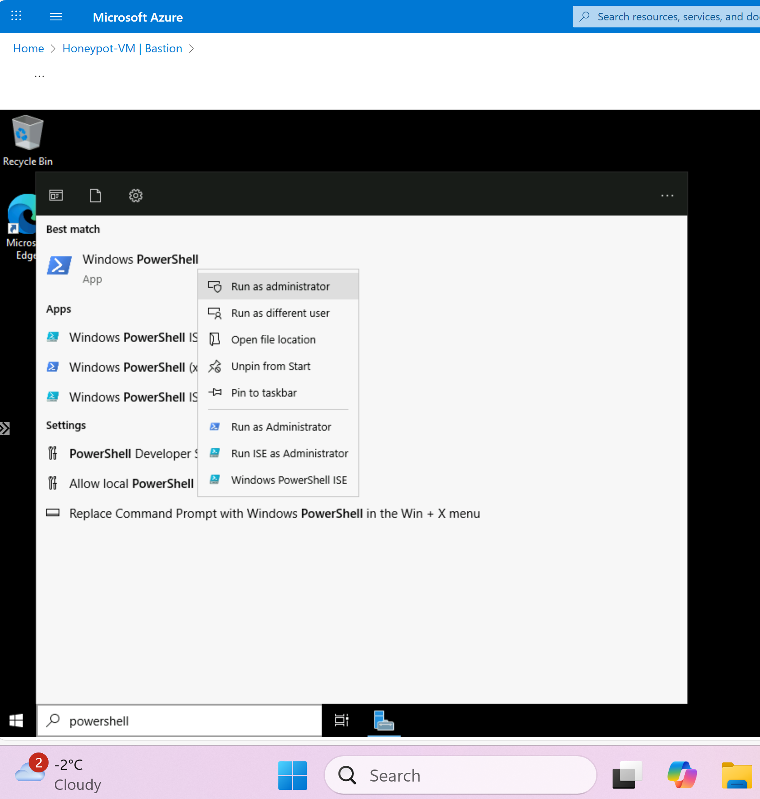
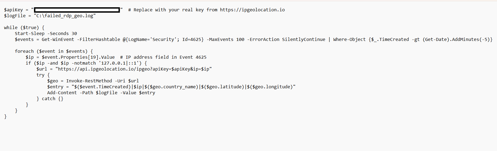
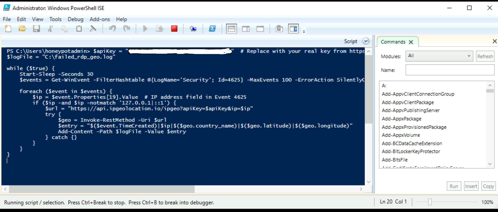
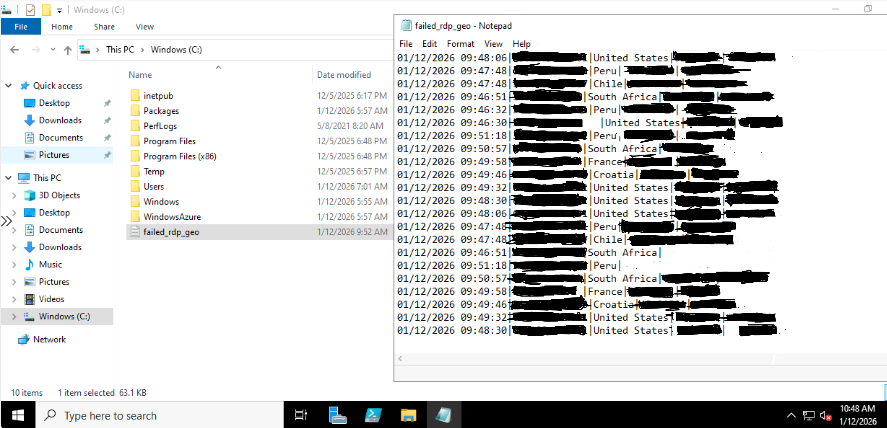

---

## Phase 3: Connecting the SIEM (Data Ingestion)
**Objective:** To transition data from a local text file to an enterprise SIEM for analysis.

**What I did:**
I connected the VM to **Microsoft Sentinel**. Since my geolocation data was in a custom format, I configured a **Data Collection Rule (DCR)**. This instructed the SIEM on how to parse my specific log file and map the fields into a custom table called `FAILED_RDP_GEO_CL_CL`.

* **The Result:** The enriched data was successfully ingested into Sentinel, allowing for advanced querying and correlation using **KQL**.

**Evidence:**
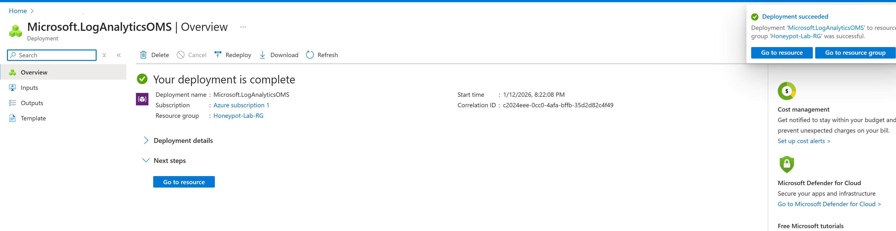

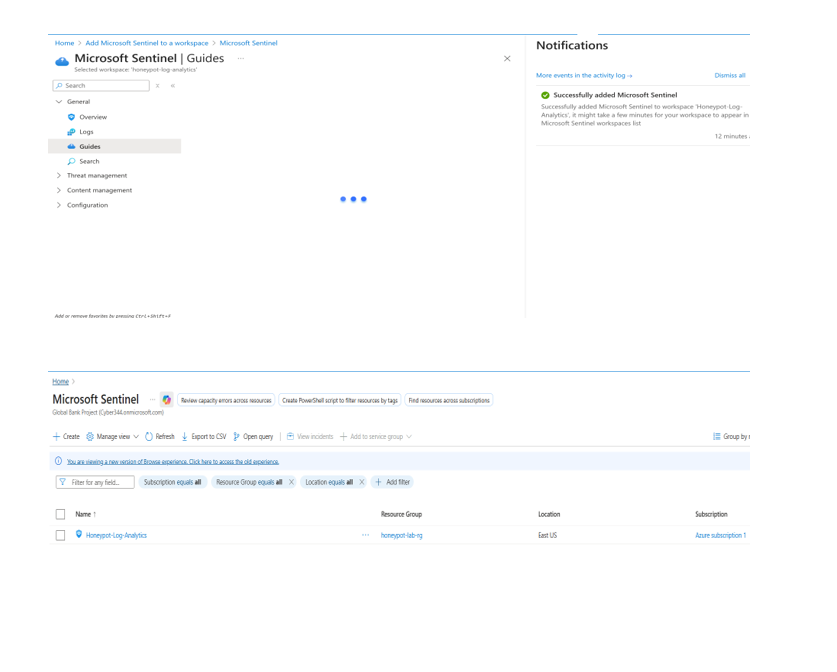

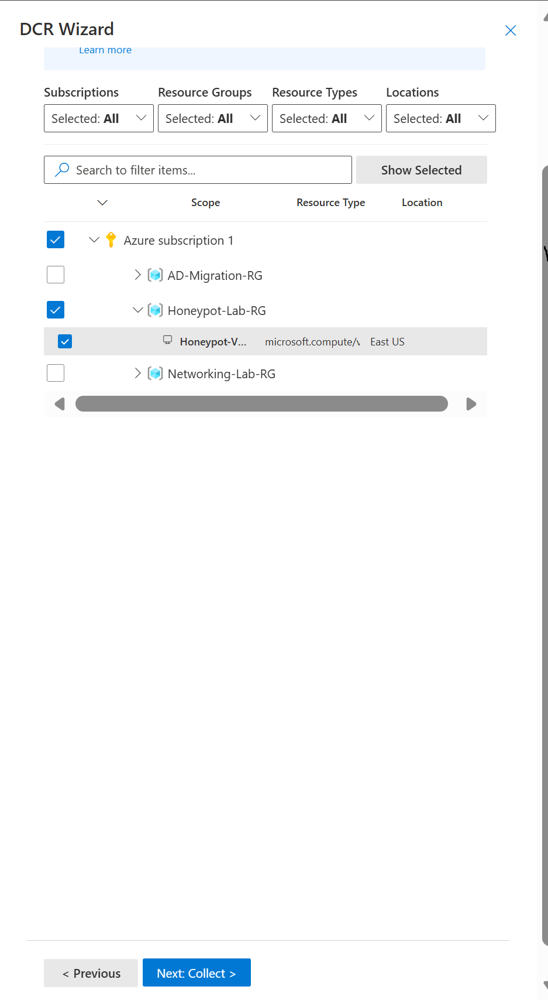
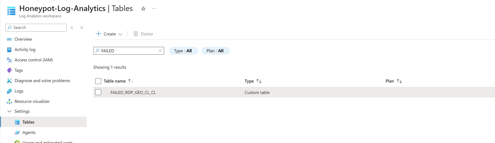
---

## Phase 4: Detecting the Threat (Analytics)
**Objective:** To identify brute-force patterns and group global attack origins.

**What I did:**
I developed a scheduled **Analytics Rule** using **KQL (Kusto Query Language)**. The system was programmed to trigger a high-severity incident if a single source IP exceeded a specific number of failed attempts within a defined window.

* **The Result:** The system accurately distinguished between random noise and coordinated brute-force attacks, providing clear visibility into the most persistent threat actors.

**Evidence:**
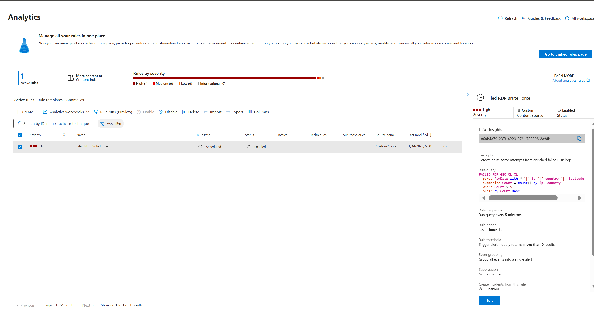
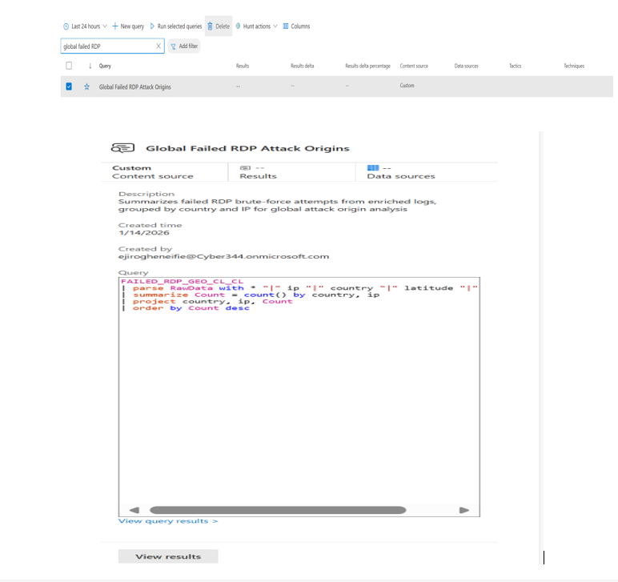

---

## Phase 5: Automated Response (SOAR)
**Objective:** To minimize response time through automated security orchestration.

**What I did:**
I engineered an **Automation Playbook** using Azure Logic Apps. Whenever a brute-force incident is created, an **Automation Rule** triggers the playbook to send an instant email notification to the security team containing the attacker’s IP and geographic details.

* **The Result:** I validated the system by triggering a real-world incident (**Incident ID 1**). The automation executed perfectly, demonstrating a functional, closed-loop response system.

**Evidence:**
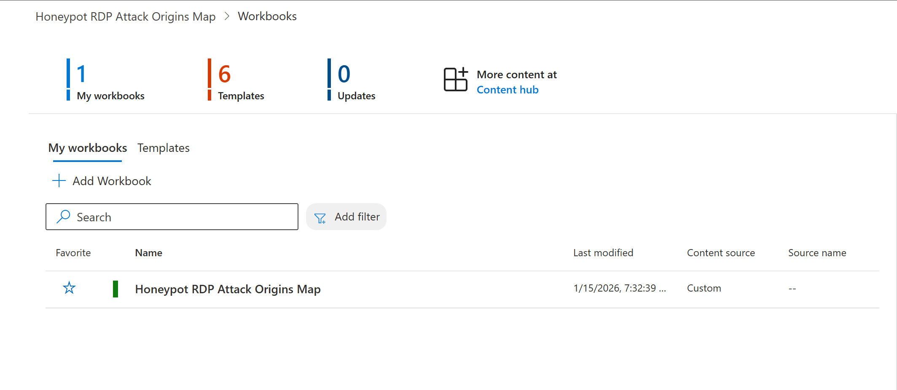
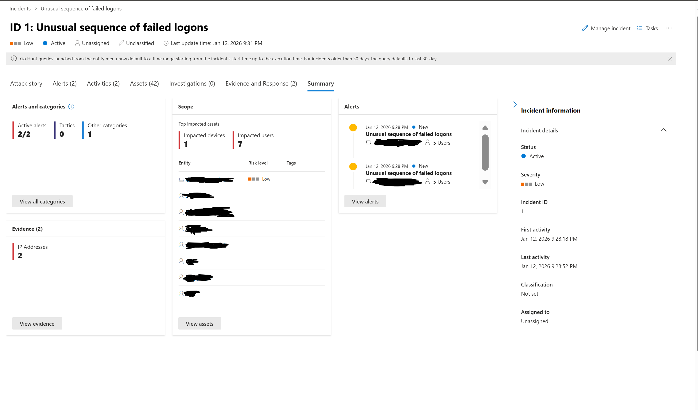
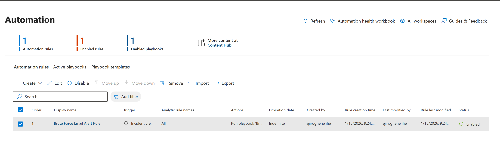

---

## Challenges & Lessons Learned
* **SOAR Notification Latency:** Encountered an issue where the Logic App playbook triggered but did not successfully deliver the notification email. I investigated this as a potential tenant-level restriction or a permissions gap within the Logic App's API connection.
* **RBAC and Permissions:** Resolved initial automation failures by correctly scoping the **Sentinel Responder** role for the Logic App's managed identity.
* **Data Ingestion Latency:** Observed that visual workbooks may lag behind actual log data. I learned to rely on raw **KQL queries** for real-time verification.
* **Cloud Resource Management:** Managed high-volume attack traffic to prevent Azure trial suspension, providing a practical lesson in monitoring ingestion costs.

---

### Summary
This project provided hands-on experience in building a functional security pipeline, from initial logging and data enrichment to detection and automated response. It allowed me to apply theoretical security concepts to a live environment and solve the practical technical challenges that arise when managing a SIEM in the cloud.
